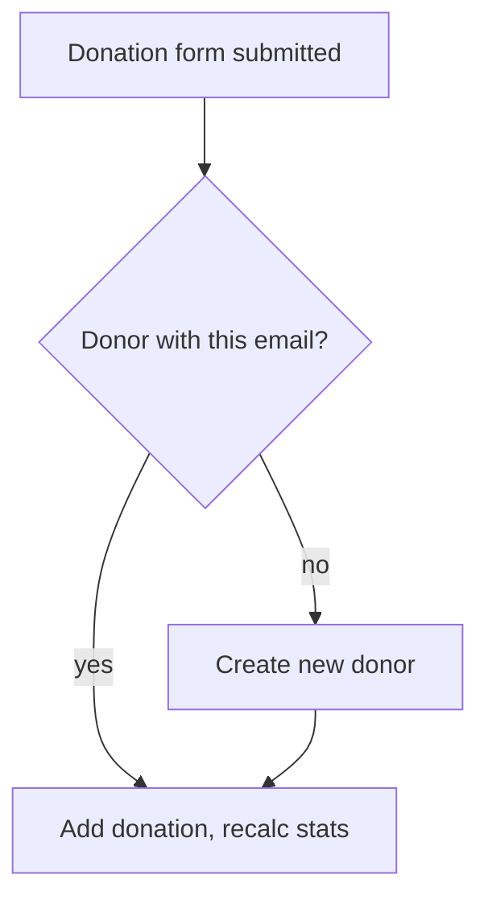

A **donor record** is one row in `wp_donorpress_donors`. It represents one person. Every donation must have exactly one donor.

## The matching rule

> Donors are matched by **email address**, case-insensitive.

This is the only matching rule. Same email = same donor, always. Different email = different donor, even if names match.

## Lifecycle

Every form submission ends with a donation record attached to a donor — either an existing one or a brand-new one.

## What's stored

| Field | Description |
| --- | --- |
| `id` | Internal ID. |
| `email` | The matching key. Unique. |
| `first_name`, `last_name` | From the form submission. |
| `phone`, `company` | Optional, only stored if the form collects them. |
| `total_donated` | Lifetime sum of completed donations. |
| `donation_count` | Lifetime count of completed donations. |
| `largest_donation` | Single largest donation. |
| `avg_donation` | Average donation amount. |
| `date_created` | First seen timestamp. |
| `date_modified` | Last update timestamp. |
| `user_id` | Optional WordPress user ID if the donor has a WP account. |
| `is_anonymous` | Public-facing anonymity flag. |

Notes are kept in `wp_donorpress_notes`, not on the donor record itself.

## Donors vs. WordPress users

These are deliberately separate:

- A **donor** is anyone who's given money. They don't need a WP account.
- A **WordPress user** is anyone with login credentials. They might never have donated.

When a logged-in user makes a donation, DonorPress matches by email and (if a match is found) sets the `user_id` link automatically. From that point forward, the donor can use the [donor dashboard](/donors/donor-dashboard).

## Stats refresh

`total_donated`, `donation_count`, `largest_donation`, and `avg_donation` are denormalized for performance — they're recomputed every time:

- A donation is created, completed, refunded, or deleted.
- An admin clicks "Recalculate stats" on the donor screen.

If you ever notice stats look wrong (rare, but possible after manual database edits), the recalculate button fixes them.

## Merging duplicates

Donors with two different emails (e.g. `sam@gmail.com` and `sam@work.com`) can be merged from the donor detail screen. After merging:

- All donations move to the canonical donor.
- The duplicate's email becomes a secondary email on the canonical record.
- Stats recalculate.
- The duplicate row is deleted.

Merging is **irreversible** — there's a confirmation step.

## Deleting

Deleting a donor:

- Removes the donor row.
- **Preserves donation rows** (sets their `donor_id` to 0 — orphaned but kept for accounting).
- Removes any notes attached to the donor.

Donations are preserved because they're financial records you may legally need to retain. If you want to delete donations too, do it explicitly from the donations admin.

## Anonymous donors

A donor flagged as anonymous:

- Is hidden from public-facing campaign donor lists.
- Still appears in the admin (anonymity is a public-facing setting only).
- Still receives receipts.
- Can still log into the [donor dashboard](/donors/donor-dashboard).

The anonymity flag can be set per-donation (on the form) or per-donor (on the admin record).
