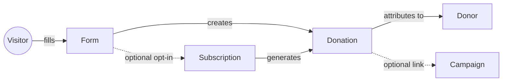

DonorPress is built around five core concepts. If you understand these, the rest of the documentation makes intuitive sense.

<CardGroup cols={2}>
	<Card title="Forms" icon="rectangle-list">
		The donation experience your visitors interact with. Reusable, embeddable.
	</Card>
	<Card title="Donations" icon="hand-holding-dollar">
		A single payment. Can be one-time or part of a recurring subscription.
	</Card>
	<Card title="Subscriptions" icon="arrows-rotate">
		A recurring donation plan. Each renewal creates a new donation record.
	</Card>
	<Card title="Donors" icon="user">
		The person making donations. Identified by email; created automatically.
	</Card>
	<Card title="Campaigns" icon="bullhorn">
		Optional grouping for goal-driven fundraising.
	</Card>
</CardGroup>

## How they fit together

A visitor fills out a **form**. The submission creates a **donation** attributed to a **donor** (matched by email or created fresh). The donation may also be tied to a **campaign** (for grouped reporting) and may have spawned a **subscription** (if recurring was opted into).

## Where data lives

Each concept maps to a database table or post type:

| Concept | Storage |
| --- | --- |
| Forms | `donorpress_form` custom post type |
| Donations | `wp_donorpress_donations` custom table |
| Subscriptions | `wp_donorpress_subscriptions` custom table |
| Donors | `wp_donorpress_donors` custom table |
| Campaigns | `donorpress_campaign` custom post type |
| Transactions | `wp_donorpress_transactions` (charge/refund ledger) |

## Read next

<CardGroup cols={2}>
	<Card title="Donations vs. Subscriptions" icon="code-compare" href="/core-concepts/donations-vs-subscriptions">
		The most common point of confusion.
	</Card>
	<Card title="Donor records" icon="id-card" href="/core-concepts/donor-records">
		How donors get created, matched, and merged.
	</Card>
	<Card title="Test vs. live mode" icon="flask" href="/core-concepts/test-vs-live-mode">
		The global switch every site needs to know about.
	</Card>
	<Card title="Currencies" icon="dollar-sign" href="/core-concepts/currencies">
		How currency is handled per-form and per-donation.
	</Card>
</CardGroup>
