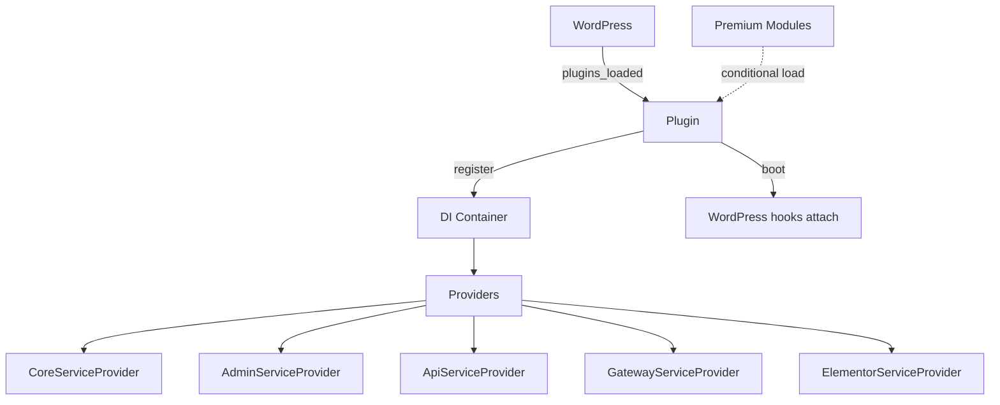

This page is for developers who need to extend DonorPress or understand the codebase before customising.

## Tech stack

- **Backend**: PHP 8.1+ with strict types throughout. PSR-4 autoloading via Composer.
- **Frontend (admin)**: React 18 + TypeScript + Vite + Tailwind CSS.
- **Frontend (donor-facing)**: Vanilla JS + Tailwind for the form bundle. Donor dashboard uses plain CSS/JS (no React).
- **Database**: Custom tables managed via `dbDelta()`.
- **APIs**: WordPress REST API v2 + custom endpoints.
- **Licensing**: Freemius SDK for plan management and updates.

## High-level architecture



The plugin uses a **two-phase service provider pattern**:

1. **Register phase** — every provider binds its classes into the DI container. No hooks are attached yet.
2. **Boot phase** — every provider attaches WordPress hooks and filters. By this point, every binding is available.

This separation prevents circular dependencies — a hook fired during registration won't trigger code that depends on a not-yet-registered service.

## File structure

```
src/
├── Plugin.php              # Bootstrap class
├── Activator.php           # Activation hook (runs migrations, creates pages)
├── Deactivator.php
├── Container.php           # Lightweight DI container
├── ServiceProvider.php     # Base provider class
│
├── Providers/              # Service providers
├── Admin/                  # Admin menu, React mount, columns
├── API/V2/                 # REST controllers
├── Database/               # Tables, migrations, query builder
│   └── Tables/
├── Models/                 # ORM-style models (Model, Donor, Donation, etc.)
├── Repositories/           # Data access layer
├── Gateways/               # Payment gateway implementations
│   ├── Stripe/
│   ├── PayPal/
│   └── TestGateway/
├── PostTypes/              # Custom post type registration
├── Taxonomies/
├── Shortcodes/
├── Form/
├── Emails/
├── Reports/
├── Frontend/
└── Localization/

modules/                    # Optional add-ons (lazy-loaded based on plan)
└── *_premium_only/

resources/                  # TypeScript source for admin SPA + form bundle
└── admin/, form/, blocks/

build/                      # Compiled frontend bundles (Vite output)
templates/                  # Theme-overridable PHP templates
assets/                     # Self-contained vanilla CSS/JS (donor dashboard, etc.)
```

## Dependency injection

The DI container (`src/Container.php`) supports three binding types:

```php
// Factory: new instance every resolution
$container->bind('logger', fn() => new Logger());

// Singleton: resolved once, cached
$container->singleton(DonorRepository::class, fn($c) => new DonorRepository());

// Pre-built instance
$container->instance('config', $configObject);

// Resolution
$repo = $container->make(DonorRepository::class);
```

## Hooks lifecycle

```php
// Plugin boot order:
register_activation_hook( __FILE__, [ Activator::class, 'activate' ] );
register_deactivation_hook( __FILE__, [ Deactivator::class, 'deactivate' ] );

add_action( 'plugins_loaded', function () {
	donorpress()->boot();
}, 10 );
```

Within `boot()`:

```php
public function boot(): void {
	$this->register_providers();   // bind everything
	$this->boot_providers();       // attach hooks
	do_action( 'donorpress/booted' ); // extension point
}
```

The `donorpress/booted` action is your safest extension point — every service is available, every hook is attached.

## Database access

Two layers:

1. **Models** (`src/Models/`) — ORM-style. `Donor::find( 42 )`, `$donor->set( 'first_name', 'Sam' )`, `$donor->save()`.
2. **Query builder** (`src/Database/QueryBuilder.php`) — for complex queries. `Donation::query()->where( 'status', 'complete' )->order_by( 'created_at' )->get()`.

For raw SQL when you must, use `$wpdb` directly. Always use `$wpdb->prepare()`.

## Reading next

<CardGroup cols={2}>
	<Card title="Service providers" icon="layer-group" href="/developers/service-providers">
		How the provider pattern works in detail.
	</Card>
	<Card title="Database schema" icon="database" href="/developers/database-schema">
		Every table column explained.
	</Card>
	<Card title="REST API reference" icon="server" href="/rest-api/overview">
		Every endpoint DonorPress exposes.
	</Card>
	<Card title="Hooks reference" icon="bolt" href="/hooks/actions">
		Actions and filters you can hook into.
	</Card>
</CardGroup>
