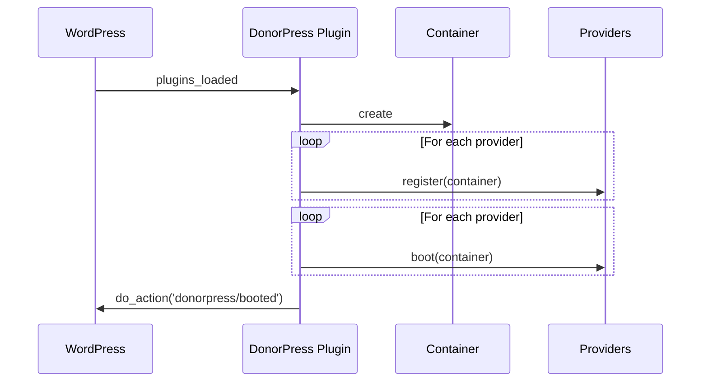

DonorPress uses a service provider pattern (familiar from Laravel and other modern PHP frameworks) to keep registration and bootstrap logic organised.

## Anatomy of a provider

Every provider extends `DonorPress\ServiceProvider` and implements two methods:

```php
namespace DonorPress\Providers;

use DonorPress\Container;
use DonorPress\ServiceProvider;

final class CoreServiceProvider extends ServiceProvider {

	/**
	 * Bind classes into the container. NO hook attachment here.
	 */
	public function register( Container $c ): void {
		$c->singleton( DonationRepository::class, fn() => new DonationRepository() );
		$c->singleton( DonorRepository::class, fn() => new DonorRepository() );
		// ... more bindings
	}

	/**
	 * Attach hooks. Bindings are guaranteed to be resolvable here.
	 */
	public function boot( Container $c ): void {
		add_action( 'init', [ $this, 'register_post_types' ] );
		add_action( 'init', [ $this, 'register_taxonomies' ] );
		add_action( 'init', [ $this, 'register_shortcodes' ] );
	}
}
```

## The two-phase boot



**Why two phases?** Without them, a provider's hook could fire while another provider hasn't bound its dependencies yet — circular dependency hell.

With two phases:

- All bindings exist before any hook is attached.
- Hook callbacks can safely resolve any service from the container.

## Built-in providers

| Provider | What it registers |
| --- | --- |
| `CoreServiceProvider` | Repositories, post types, taxonomies, shortcodes, database migrations. |
| `AdminServiceProvider` | Admin menu, React mount point, asset enqueuing, list table columns. |
| `ApiServiceProvider` | REST routes for v2 API. |
| `GatewayServiceProvider` | Gateway registry, gateway discovery, webhook handlers. |
| `ElementorServiceProvider` | Elementor widgets (only if Elementor is active). |

## Registering your own provider

For larger custom integrations, write your own provider:

```php
namespace YourPlugin\Providers;

use DonorPress\Container;
use DonorPress\ServiceProvider;

final class YourCustomProvider extends ServiceProvider {

	public function register( Container $c ): void {
		$c->singleton( YourService::class, fn() => new YourService() );
	}

	public function boot( Container $c ): void {
		add_action( 'donorpress/donation/created', [ $this, 'on_donation' ] );
	}

	public function on_donation( $donation ): void {
		// React to a new donation
	}
}
```

Register your provider with DonorPress in your plugin's bootstrap:

```php
add_action( 'donorpress/booted', function () {
	donorpress()->add_provider( new \YourPlugin\Providers\YourCustomProvider() );
} );
```

## Lazy providers

For providers that only need to load conditionally (e.g. only in admin context):

```php
add_action( 'admin_init', function () {
	donorpress()->add_provider( new \YourPlugin\Providers\AdminOnlyProvider() );
} );
```

## Why not just `add_action()` directly?

You can — that's perfectly fine for small integrations. The provider pattern earns its keep when:

- You have multiple related classes that need to be wired together.
- You want testable code (providers can be instantiated in tests with a mock container).
- You're shipping an extension that itself needs an extension surface.

For a one-line "send a webhook on every donation", just use `add_action( 'donorpress/donation/created', ... )`.

## Convention: provider-per-feature

Providers are organised by feature, not by hook type. So `EmailServiceProvider` registers email-related classes AND attaches all email-related hooks — keeping all the email plumbing in one file.

This is opposite to "hooks file + classes file" patterns. Both work; DonorPress prefers the cohesive style.

## Related

<Card title="Architecture overview" icon="diagram-project" href="/developers/architecture-overview">
	The bigger picture.
</Card>
